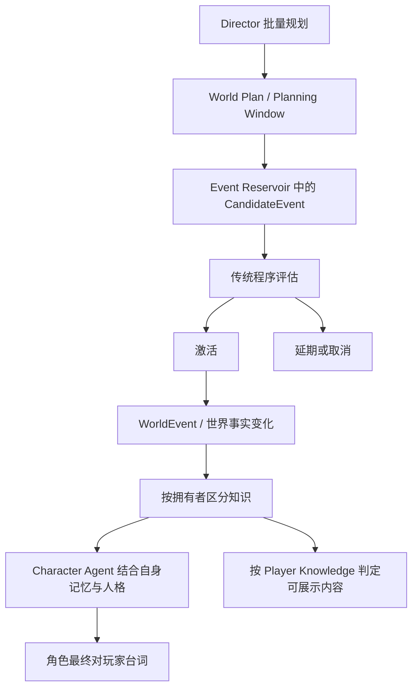

# 系统概览

状态：Stage 0 概念架构；没有对应的业务实现。规则来源为 [PRODUCT_SPEC.md](../product/PRODUCT_SPEC.md) 中的 FR-01 至 FR-24。本文划分概念职责，不确定服务部署方式、编程语言、框架、存储引擎或通信协议。

## 1. 系统目标与边界

LivingWorld 的核心是持续存在、由事件推动的多角色世界（FR-01）。玩家对话是其中一种互动，而不是整个世界的全部状态。

| 概念职责 | 负责什么 | 边界 |
| --- | --- | --- |
| 世界运行 | WorldClock、WorldState、地点、已发生事件与世界事实的概念一致性 | 玩家同时只能处于一个物理地点；事实不等于所有参与者都知道 |
| Director | 时间、地点、世界事件、角色活动、相遇、关系变化、宏观剧情调度 | 改变世界，但不能直接替 Character Agent 编写最终对玩家台词 |
| Character Agent | 自己拥有的记忆、人格表达和与玩家对话 | 可使用的知识与记忆不自动覆盖世界全部真实事实 |
| 规划与候选事件处理 | 批量 World Plan、Planning Window、Event Reservoir；传统程序激活、延期或取消候选事件 | 候选尚未激活时不构成世界事实；禁止为每个普通小事件单独调用 LLM |
| 知识与记忆 | 区分 WorldTruth、Character Knowledge、Player Knowledge，以及各自拥有的记忆 | 后台发生但玩家不知道的事件不能直接展示给玩家 |
| 主动联系 | 按 Busy / Available 状态与统一目的组织 Outreach Episode | 同一理由最多主动发送一次；未回复不能持续催促 |
| 内容构建与导入 | 带来源的 Character Draft / World Draft；Character Card V2/V3、PNG/JSON、Lorebook 导入需求 | 自动生成内容必须经过 Draft → Preview → Commit |
| 时间线与恢复 | Checkpoint 与 Timeline Branch | 分支、恢复和跨分支信息语义仍待确认 |
| 产品交互与调试 | 非技术用户体验、Director 风格面板、Advanced/Developer Settings、Developer Mode Trace | 普通玩家不能看到关系数值；开发者可见范围仍需进一步定义 |
| LLM 使用治理 | Provider 与模型概念、Token / Latency / Cost 记录、预算与模型路由 | 成本治理不能绕过已冻结产品规则；具体机制尚未选择 |

以上是职责划分，不表示这些职责一定要做成独立进程或服务。

## 2. 规划、事实与表达

图中箭头表示概念依赖，不表示每个事件都要调用 Agent、产生消息或立刻展示给玩家。Director 可安排联系目的和参与者，最终角色台词由 Character Agent 负责。

Planning Window 耗尽或大量计划失效才触发 Replan（FR-15）；上述条件的判定标准待确认。一次普通候选事件延期或取消不能被自行解释为逐事件调用 LLM 的授权。

## 3. 核心边界

- **事实边界**：World Plan 是计划，CandidateEvent 是可能性，WorldEvent 是已激活的真实发生事件。详见 [EVENT_MODEL.md](EVENT_MODEL.md)。
- **知识边界**：世界中发生的事情，不自动成为所有角色或玩家已知的信息。详见 [KNOWLEDGE_MODEL.md](KNOWLEDGE_MODEL.md)。
- **表达边界**：Director 调度世界与主动联系，Character Agent 负责自己的表达。详见 [DIRECTOR_MODEL.md](DIRECTOR_MODEL.md)。
- **记忆边界**：记忆属于具体拥有者；记忆的主观内容不自动改写世界真实事实。详见 [MEMORY_MODEL.md](MEMORY_MODEL.md)。
- **位置边界**：对话或收到消息不意味着玩家发生物理移动。玩家任意时刻只能存在于一个物理地点（FR-06）；移动过程的建模待确认。
- **生成内容边界**：Draft、Preview 与 Commit 必须区分。候选事件的“激活”和生成内容的“Commit”不是同一个概念。
- **未定适用范围**：FR-19 对运行时台词、World Plan、事件生成与记忆摘要的适用边界及流程衔接待确认（产品问题 P-16）；不能自行缩窄为仅适用于 Builder。

## 4. 文档导航与变更纪律

| 文档 | 用途 |
| --- | --- |
| [PRODUCT_SPEC.md](../product/PRODUCT_SPEC.md) | 冻结规则原文与范围 |
| [PRODUCT_PRINCIPLES.md](../product/PRODUCT_PRINCIPLES.md) | 规则的设计含义 |
| [USER_FLOWS.md](../product/USER_FLOWS.md) | 尚未实现的产品流程 |
| [DOMAIN_MODEL.md](DOMAIN_MODEL.md) | 概念对象及职责；不设计数据库字段 |
| [DIRECTOR_MODEL.md](DIRECTOR_MODEL.md) | 世界调度、规划和主动联系边界 |
| [EVENT_MODEL.md](EVENT_MODEL.md) | 候选事件与真实事件的区别 |
| [KNOWLEDGE_MODEL.md](KNOWLEDGE_MODEL.md) | 事实、知识归属与展示边界 |
| [MEMORY_MODEL.md](MEMORY_MODEL.md) | 记忆归属与其他概念的区别 |
| [ADR/README.md](ADR/README.md) | 后续架构决策的记录方法 |
| [research/README.md](../research/README.md) | 待研究问题与证据记录要求 |

冻结规则以产品规格原文为准；文档中的解释不能覆盖规则。未定事项保留“待确认”标记，架构候选方案在研究后通过 ADR 记录；未获确认的方案不能写成已接受的架构决定。

## 5. 下一步需要澄清的架构输入

世界时间推进方式、暂停与离线推进；必要主动联系的定义；同一理由的身份与跨时间线作用域；多角色一次主动联系的消息计数；Planning Window 耗尽与大量计划失效的判定；事实冲突处理；Checkpoint 恢复与分支信息继承；知识和记忆修正；导入兼容边界；预算触顶后的行为。

这些问题的具体决策均未在 C-001 中作出。研究清单见 [research/README.md](../research/README.md)。
