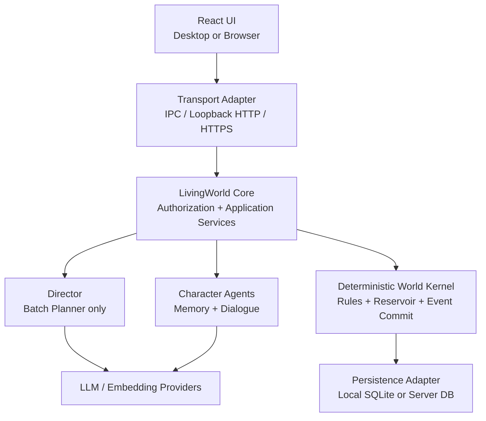
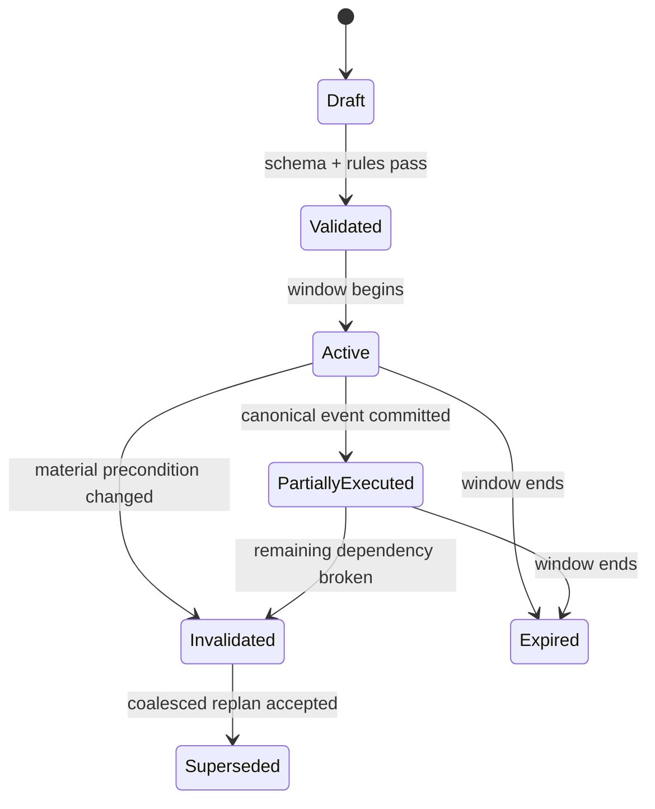

# LivingWorld Architecture Research W-001

**主题：** LivingWorld 最终产品架构调研（非 Demo / 非 MVP）  
**调研日期：** 2026-09-15  
**证据标准：** 优先采用官方文档、论文与成熟项目源码。本文使用三种标记：**【事实】**为可由来源验证的现状；**【建议】**为本项目的工程决策；**【假设】**为必须通过基准、可用性测试或用户测试验证的判断。

## 执行结论

LivingWorld 最合适的最终形态是一个 **local-first、kernel-first、transport-neutral** 的产品：

- **一个可独立部署的 LivingWorld Core** 持有全部世界规则、Director、权限化知识读取、事件提交和 catch-up；桌面端只是把它作为本机 sidecar 启动，Web/云端则把同一个 Core 作为服务部署。
- **Director 不是事件执行器，也不是“总 Prompt”。** 它是唯一能做宏观模拟与调度的 LLM 规划器；每次只产生一个 Planning Window 的结构化提案。确定性代码验证前置条件、选择候选事件、写入事实并负责重放。
- **真实世界状态采用“混合式事件架构”**：`已发生的领域事件` append-only，当前世界状态、关系、日程和知识读取模型是事务内更新的投影；Draft、缓存、向量、事件候选池使用 CRUD。不要把全部数据强行 Event Sourcing。
- **本机关闭时不运行任何后台模拟。** 下次启动按持久化的世界时钟计算 elapsed time，并以粗粒度 batch catch-up 补算；角色活动和候选事件按 Planning Window 生成，不按每个事件调用模型。
- **知识隔离必须是数据模型和查询权限，不是 Prompt 约定。** World Truth、Character Belief、Player Knowledge 三种对象分库/分表、分向量命名空间、分检索 API；LLM 只能拿到 Context Assembler 对该 principal 授权后组装的内容。
- **桌面默认不需要 MySQL、Redis、Qdrant 三件套。** 本地应先用 SQLite WAL + FTS5，向量能力由可替换接口承载；云端首选 PostgreSQL + pgvector 的单关系库方案。若为了 MySQL 能力展示或既有团队标准而坚持 MySQL，则 MySQL InnoDB + Qdrant 是可接受的替代，但 Redis 仍仅在多进程/多实例后才加入。

这套取舍不是降低产品目标，而是将复杂度放在真正有作品集价值的地方：可审计的世界推进、可证实的信息边界、幂等事件执行、重放/投影、离线追赶与跨端同步冲突处理。

---

## 1. 总体架构：local-first、desktop、Web server 与未来云部署

### 1.1 推荐的逻辑拓扑

| 层 | 最终职责 | 桌面模式 | Web / 云模式 | 判断 |
|---|---|---|---|---|
| Presentation | 面向普通用户的地图、角色、对话、新闻、Busy/Available；不展示 Prompt 或采样器 | React UI 封装进 Tauri | 同一 React UI 浏览器访问 | **【建议】**同一 UX，不让部署方式改变世界语义 |
| Transport Adapter | 身份、流式输出、命令边界 | Tauri IPC 只做启动/文件选择；UI 经随机令牌的 loopback API 访问 Core | HTTPS API / WebSocket | **【建议】**让前端不依赖桌面 IPC，避免未来重写 |
| LivingWorld Core | Command API、鉴权、事务、Context Assembly、Director 调用、Catch-up | Python sidecar 进程，绑定 `127.0.0.1` | Python 容器/服务 | **【建议】**Python 是项目主语言，方便 Agent 与数据逻辑统一 |
| Deterministic World Kernel | 世界时间、位置约束、规则校验、Reservoir 选择、事件提交、重放 | 同一 Python 包 | 同一 Python 包 | **【建议】**这是产品的真正核心，绝不可藏在 LLM Prompt 中 |
| Persistence | 事实日志、投影、记忆、Draft、资产、同步元数据 | SQLite WAL 文件 + 资产目录 | PostgreSQL（首选）或 MySQL + Qdrant（可选） | **【建议】**以 Repository/Unit-of-Work 屏蔽存储差异 |
| Background execution | 仅处理“进程活着时”的 I/O、重试、作业 | asyncio；可选 APScheduler | asyncio + worker/队列按负载扩展 | **【建议】**关闭的桌面不应被假装成在线服务器 |

**【事实】** Tauri 使用 Web 前端与 Rust 后端/系统集成，适合把既有 Web UI 包装为跨平台桌面应用；其权限能力可按窗口/WebView 限制。参见 [Tauri v2 文档](https://v2.tauri.app/) 与 [Tauri 的安全权限说明](https://v2.tauri.app/blog/tauri-20/)。**【建议】**Tauri 的 Rust 层只负责“壳”：进程生命周期、通知、文件选择、安全存储桥接；不要把 Director 或世界规则写进 Rust，否则 Web/云端会拥有第二套后端。

**【事实】** Python 的 `asyncio` event loop 用于运行协程、回调和网络 I/O；FastAPI 可提供基于类型的 API 校验与 OpenAPI 接口。见 [Python asyncio](https://docs.python.org/3/library/asyncio-eventloop.html) 与 [FastAPI 官方文档](https://fastapi.tiangolo.com/)。**【建议】**Core 采用 FastAPI/ASGI 只是一个可替换的传输实现；领域内核不得依赖 HTTP request 对象。

### 1.2 三种部署形态必须共享同一个世界内核

| 形态 | 权威写入者 | 存储 | 适用场景 | 不可妥协点 |
|---|---|---|---|---|
| Desktop local-first | 当前设备上的 Core | SQLite WAL + 本地资产 | 单人世界、隐私优先、离线可浏览与本地模型 | 世界永远可在本机打开；网络仅影响云模型/联网研究 |
| Self-hosted Web | 用户部署的一个 Core | PostgreSQL 或 MySQL | 多设备、家庭/小圈私服 | 服务端是权威写入者；浏览器没有直接数据库权限 |
| Managed cloud | 租户化 Core worker | PostgreSQL + pgvector（首选） | 多设备、备份、共享、异步研究 | `world_id`/`tenant_id` 是每个查询与索引的强制条件 |

**【建议】**为每个世界定义一个 `World Package`：`world_id`、版本化 schema、SQLite 数据库、资产清单、导入卡原件和导出包。桌面是该包的本地权威副本。登录云同步后，应采用 **single-writer lease**：同一世界同一时刻只允许一个 Core 推进模拟；另一设备只能只读、请求接管，或停留在待合并 Draft。不要对“真实世界时间线”使用 CRDT 自动合并——两台离线设备都让同一角色在同一时段做不同事，不存在无损自动合并。

**【假设】**用户会接受“本地优先但云模型可选”的边界：无网络时仍可查看、编辑、读取已有记忆和执行确定性世界操作；需要生成新对话/新计划时，可选择本地模型、已配置云模型或等待连接。所谓 local-first 不等于每一种模型能力都必须离线。

### 1.3 关键边界

1. UI 只能发 **Command**（如“玩家移动到咖啡店”“设置 Busy”“发送一句话”），不能直接改状态表。
2. Character Agent 只能提交 `WorldImpactProposal`，不能写 World Truth；例如角色私密对话的原文不自动进入 Director。
3. Director 只能返回 `DirectorPlan`，不能执行数据库工具或网络写操作。
4. Kernel 是唯一能提交 `WorldEvent`、改变位置、关系、可见性和 Player Knowledge 的组件。
5. LLM 原始输入/输出、模型版本、token/cost、plan hash 进入审计日志；敏感对话正文默认不进入云端可观测平台。

---

## 2. 离线 catch-up simulation：无需关机后台运行

### 2.1 基本原理

**【建议】**持久化的不是“后台计时器”，而是世界时钟锚点：

| 字段 | 含义 |
|---|---|
| `world_time` | 最后一条已提交世界事件对应的逻辑时间（UTC Instant） |
| `observed_wall_time_utc` | Core 最后一次可靠地观察现实 UTC 的时间 |
| `time_scale` | 现实时间到世界时间的可配置倍率 |
| `simulation_version` / `rule_set_version` | 解释事件与重放的版本 |
| `active_plan_cursor` | 已处理到哪个 Planning Window / event slot |
| `world_clock_policy` | 最大离线追赶、倒拨时钟、时区变化、暂停规则 |

启动后计算：`elapsed = clamp(now_utc - observed_wall_time_utc, 0, max_offline_elapsed) × time_scale`，随后令目标时间为 `world_time + elapsed`。运行期可同时记录 monotonic clock 以避免本次进程内系统时间跳变；跨进程只信 UTC 锚点并记录异常。**【建议】**任何超出上限、明显倒拨或从备份恢复导致的负值都进入“用户确认/安全暂停”，绝不让世界倒退或一次性跳数年。

SQLite 的事务与 WAL 适合这种本机持久状态：WAL 机制让提交追加到 WAL，崩溃后能恢复到一致状态；SQLite 官方也说明事务中断后的回滚恢复是自动的。见 [SQLite WAL](https://www.sqlite.org/wal.html) 与 [SQLite corruption/resilience 文档](https://www.sqlite.org/howtocorrupt.html)。

### 2.2 Catch-up 算法

**【建议】**以下为最终产品算法，而非每分钟循环：

1. **取得世界写锁与快照。** 读当前 projection、最后 `world_time`、未结案 Reservoir、待投递 Outreach、玩家 Busy/Available 与物理位置；记录 `CatchUpRequested`。
2. **划分自适应 Planning Window。** 正常在线可用 1 个世界日；短离线合并为 3–7 个世界日；长离线以最长 14 日为一个 macro window，并设置每次启动最大 LLM 预算。超过预算的早期窗口只允许“低分辨率生活摘要/状态变化”，不生成大量戏剧事件。
3. **每个 Window 最多一次 Director batch planning 调用。** 输入是压缩后的真实状态、角色近期摘要、关系张力、已有候选事件、规则和预算；输出是每个角色的活动区块、相遇机会、候选事件、关系机会、潜在主动联系，而不是逐事件自然语言。使用 JSON Schema/结构化输出；结构化输出能约束模型输出遵循定义的 schema，但仍不等于业务正确，故下一步仍需规则校验。见 [Structured Outputs](https://developers.openai.com/api/docs/guides/structured-outputs) 与 [Pydantic validation/schema](https://docs.pydantic.dev/latest/concepts/models/)。
4. **写入 Plan 和 Event Reservoir，不改世界事实。** Kernel 做 schema、角色可用性、地点可达、时间冲突、权限、唯一性、速率预算与前置条件验证。无效 item 标记 `rejected` 并保存原因。
5. **确定性推进。** 按 due time 取 Reservoir 候选，先硬约束过滤，再使用固定 seed 的加权选择；对激活项再次校验前置条件。成功才在同一事务中追加 `WorldEvent`、更新投影、生成有授权的 Observation/Knowledge 记录，并移动 cursor。
6. **压缩与投递。** 早期日常活动归为 `WorldIntervalResolved` 或角色日记摘要；只有显著事件保留细粒度 `WorldEvent`。玩家离线期间不作为“自动目击者”，其知识只在合理渠道实际投递时产生；符合条件的 Outreach Episode 进入待投递队列。
7. **原子完成。** 事务提交新 `world_time`、`observed_wall_time_utc`、cursor 和审计记录；失败可从上一条 cursor 幂等重试。

### 2.3 物理位置与离线玩家

**【建议】**玩家只有一个 `PlayerPresence(location_id, valid_from, mode)`，数据库层用时间不重叠约束/写入服务校验保证任一时刻只有一条有效位置。离线时该位置保留、`mode=inactive`：角色可以路过该地点、彼此相遇，但不能把玩家视为亲历者。玩家重连后得到的信息只能来自：

- 在重连后亲自到场/对话；
- 有来源的新闻、公告、信件、照片、物证；
- 知情角色在对话中自然披露；
- 既有主动联系的待投递消息。

这使“玩家看不见的角色关系和事件”成为真实后台状态，又不把后台日志直接剧透给玩家。

### 2.4 Offline outreach 的特殊规则

**【建议】**`Busy` 在 catch-up 中同样生效：Busy 时普通主动联系全部禁止；Available 时只允许 Kernel 在一个合理时机激活 **一个** Episode。角色可以在离线期间形成“想联系”的候选，但只有 Episode 被确定性激活才生成消息。若玩家重连前该理由已失效，消息不强行弹出，改为取消或转为可在新闻/后续对话得知的事实。

---

## 3. Director batch planning、Event Reservoir、失效与 Replan

### 3.1 数据模型

| 对象 | 核心字段 | 是否 LLM 可写 | 生命周期 |
|---|---|---:|---|
| `DirectorPlan` | `plan_id, world_id, window_start/end, state_hash, rule_version, planner_model, prompt_version, seed, status` | 仅产生 proposal | `draft → validated → active → superseded/expired` |
| `PlanItem` | `actor_id, action_kind, time_range, location, preconditions, dependencies, intended_effect, priority` | 仅 proposal | 可单项 rejected / invalidated |
| `EventCandidate` | `candidate_id, earliest/latest, participants, conflict_keys, hard_constraints, score_features, defer_count, source_plan_id` | 仅 proposal | `pending → activated/deferred/cancelled/expired` |
| `EventReservoir` | 按世界和窗口组织的候选集合与预算 | 否 | 工作集，CRUD 状态可变 |
| `WorldEvent` | `event_id, type, occurred_at, payload_version, causation_id, correlation_id, idempotency_key` | 否 | append-only canonical log |
| `Projection` | 角色位置、关系、日程、世界事实、地点状态 | 否 | 由事件同步更新，可重建 |
| `OutreachEpisode` | `purpose_key, reason_fingerprint, target_player, member_agents, freshness_until, status` | Director 只提案 | `candidate → scheduled → delivered/cancelled/expired` |

`DirectorPlan.state_hash` 必须由计划输入的 canonical state、规则版本和现有计划摘要构成；`plan_id + item_id` 或明确 `idempotency_key` 用于阻止重试重复写入。

### 3.2 Reservoir 选择器：LLM 提议，代码裁决

**【建议】**每个候选分两层处理。

**硬约束（先过滤，绝不由 LLM 覆盖）**

- 参与者在该时间段可用，且没有不兼容的既定行动；
- 地点连通、旅行时间与容量成立；
- 所需 World Truth/关系状态仍成立；
- 玩家只有一个位置，且玩家知识/Busy 规则满足；
- 同一角色每单位时间的行动、相遇、剧情强度不超过上限；
- `reason_fingerprint` 不曾对该玩家成功主动发送；
- 无互斥 conflict key（例如同一物品、同一场地、同一角色的排他任务）。

**软评分（可调、可解释、确定性）**

`score = relevance + relationship_tension + opportunity + novelty + player_affordance − repetition − disruption − cost`。

LLM 可以给出 `relationship_tension`、主题标签与理由，不能直接给最终排序。Kernel 对合法候选按 score 排序，使用 `HMAC(plan_seed, candidate_id)` 作为稳定 tie-break；再以角色/地点预算和冲突图做贪心选择。这样同一快照和种子可重放，也便于测试“为什么这个事件被激活”。

**延期与取消：**窗口未过期且仍有修复希望时 `deferred`，保存 defer 原因与下次可选时段；到 `latest_at`、前置条件永久不成立或冲突项胜出时 `cancelled/expired`。取消同样是审计事实，不是静默删除。

### 3.3 计划失效与 Replan

**【建议】**不要“一件事不对就立即再问一次模型”。重规划触发器分为：

- **轻微变化**（某候选延期、非关键角色晚到）：局部失效，Reservoir 在已有候选内重新选择；
- **实质变化**（玩家移动/发言改变了核心关系、地点关闭、关键角色受伤、计划 `state_hash` 依赖变化）：标记受影响依赖闭包为 `invalidated`；
- **Replan coalescer**：将同一小时间隔内的实质变化合并成一个 `ReplanRequest`，输入“原计划剩余部分 + 实际已发生事件摘要 + 新状态”，只覆盖当前窗口余下部分。每窗口设调用上限；超限时采用规则 fallback 和下一窗口恢复。

这正是冻结原则“批量调用一次解决一个时间窗口”落到数据结构后的版本，而不是一个 Director 每分钟想一个新剧情。

### 3.4 主动联系的不可重复性与群体目的

**【建议】**定义：

`reason_fingerprint = hash(world_id, player_id, reason_type, causal_event_ids, purpose_key, canonical_participants)`。

在 `delivered` 写入时建立唯一索引 `(world_id, player_id, reason_fingerprint)`；失败重试也使用同一 idempotency key。多角色联系不是多条独立邀约：一个 `OutreachEpisode` 必有一个 `purpose_key`（如“为某次演出协调集合”），成员角色都是该目的的不同声音/分工。若目的不同，必须等待另一个可用窗口，而不能伪装成“多人同时打扰”。

---

## 4. World Event：CRUD、Event Sourcing 还是混合？

**【事实】** Event Sourcing 的核心是把状态变化记录为事件，并可通过重新处理事件重建状态；其优势是历史查询、审计与调试，代价是投影、版本迁移与重放复杂度。见 [Martin Fowler: Event Sourcing](https://martinfowler.com/eaaDev/EventSourcing.html) 与 [Event-Driven](https://martinfowler.com/articles/201701-event-driven.html)。

| 方案 | 优点 | 致命问题 | LivingWorld 结论 |
|---|---|---|---|
| 传统 CRUD only | 简单、查询直观 | 无法可靠回答“角色为何知道这件事”“这次 catch-up 改了什么”“某 bug 从哪个计划开始”；难做回放 | **不推荐**作为世界历史核心 |
| 全量 Event Sourcing | 理论上所有状态可回放、审计强 | 把向量、缓存、Draft、每一步移动都变成事件，版本演化和重放成本急剧膨胀；开发时间会被基础设施吞掉 | **不推荐** |
| 混合：canonical event log + projection + CRUD 工作表 | 保留叙事因果、时间旅行和调试，同时让高频/临时对象保持可控 | 需要明确哪些是 canonical event，并维护投影一致性 | **推荐** |

### 4.1 推荐的混合边界

**追加到 `WorldEvent` 的内容**：角色抵达/离开（仅有叙事意义时）、关系变化、正式相遇、事件发生、世界事实改变、玩家发现、主动联系已发送、用户确认 Builder Draft、关键状态纠正。

**保留 CRUD 的内容**：Event Reservoir 状态、Director Draft、聊天草稿、UI 首选项、缓存、嵌入向量、搜索索引、LLM trace 原文、可重建的日程 projection、下载源文件。

**事务规则：**一个 Command 由 Kernel 在数据库事务中执行“追加 canonical event → 更新 projection → 生成 outbox record”。向量化、推送通知等事务外副作用从 outbox 幂等消费；不能先发消息再尝试写事件。InnoDB 提供事务、崩溃恢复和行级并发控制，适合作为 MySQL 方案的核心关系库。见 [MySQL InnoDB ACID](https://dev.mysql.com/doc/refman/8.4/en/innodb-introduction.html) 与 [transaction model](https://dev.mysql.com/doc/refman/8.4/en/innodb-transaction-model.html)。

### 4.2 复杂度与简历价值

| 能力 | 用混合架构如何展示 | 面试可讲的真实点 |
|---|---|---|
| 可重放 | 用 `event_id`/snapshot 重建关系与地点投影 | Event schema version、upcaster、幂等 handler |
| 一致性 | Command 事务 + outbox | 事务边界、at-least-once、去重 key |
| 可解释性 | 任何可见新闻/角色台词能追到 `WorldEvent → source plan → source facts` | 因果链、审计、debugging |
| 演进性 | 新 projection 可由历史事件回填；旧 payload 用 migrator | CQRS 的选择性使用，而非背名词 |

**【建议】**最好的简历表述不是“使用 Event Sourcing”，而是“实现 immutable world-event ledger 与事务化 projection；支持 catch-up replay、idempotent outbox 和事件版本迁移”。前提是这些功能有集成测试与可演示的时间线界面。

---

## 5. World Truth、Character Knowledge、Player Knowledge：防信息泄漏的数据模型

### 5.1 三个知识域不能混为一个 `memories` 表

| 域 | 谁可读 | 代表对象 | 如何产生 | 能否为假 |
|---|---|---|---|---|
| `WorldTruth` | Kernel、受限 Director | “A 15:00 在地点 L 与 B 会面” | 已提交 WorldEvent、用户确认的 Builder revision | 不应；纠错要以新事件修正 |
| `CharacterBelief` | 对应 Character Agent；仅经授权的编辑工具 | “A 听说 B 可能搬家了” | 明确 Observation、谈话、文书、推理 | 可以；有置信度/来源 |
| `PlayerKnowledge` | 该玩家与 UI | “玩家从新闻得知 A 与 B 冲突” | 亲历、对话披露、新闻投递、物证 | 可以是不完整/传闻，但必须标来源 |

**【建议】**三类记录共享概念模型，却不共享读取路径：

`KnowledgeAssertion(id, scope, owner_principal, subject, predicate, object_or_value, valid_time, asserted_at, confidence, epistemic_status, provenance_event_id, source_assertion_id, visibility, redaction_level)`。

- `scope=truth` 只能由 Kernel 写；
- `scope=character_belief` 必须有 `knower_character_id`；
- `scope=player_knowledge` 必须有 `player_id` 与 `delivery_channel`；
- `epistemic_status` 至少有 `observed / told / inferred / rumoured / retracted / forgotten`。

关系和地点也要使用稳定 entity ID，而不是靠角色名字匹配。角色知道“听说”，不等于世界真实发生；玩家没看到，不等于玩家“应当知道”。

### 5.2 强制访问控制流程

1. 每次查询都携带 `Principal`: `Director`, `Character(character_id)`, `Player(player_id)`, `BuilderEditor`, `System`。
2. `KnowledgeService.visible_context(principal, scene)` 先在 SQL/向量 metadata 层过滤 `scope/owner/visibility/time`，**再**做语义相似度排序；绝不先全库向量检索、再靠 Prompt 说“忽略秘密”。
3. Context Assembler 返回带来源和不确定性的小型 `FactPacket`；Character Agent 看不到 `WorldTruth` 的裸表，也看不到其他 Character 的私有信念。
4. 每个新 WorldEvent 只产生明确的 `Observation`：在场角色可知、新闻订阅者可知、玩家实际收到才可知。没有 Observation 就没有知识写入。
5. 在测试库插入“canary secret”：对每个 principal 的上下文构建、向量检索、日志导出和模型请求进行泄漏断言。

**【建议】**Director 不应读取私密聊天全文。Character Agent 仅在需要改变客观世界时，发布经过 schema 验证的 `WorldImpactProposal`（如“玩家答应明日赴约”）；Kernel 接受后才形成 World Truth。这样 Director 能管理世界，却不成为所有私密内心活动的上帝视角。

### 5.3 向量检索也必须隔离

**【建议】**至少使用分离 collection/namespace：`truth_director`, `character/{id}`, `player/{id}`, `builder_sources`；任何向量 point payload 都含 `world_id, scope, owner_id, visibility, valid_from/to, memory_id, embedding_version`。检索 API 不接受“任意 collection 名称”这一类来自模型的参数。

---

## 6. 长期记忆与 Vector DB：不因流行而拆库

### 6.1 记忆分层

**【建议】**长期记忆不是“聊天记录塞进向量库”。应分为：

| 层 | 载体 | 写入条件 | 检索用途 |
|---|---|---|---|
| Working memory | 当前会话、当前场景状态 | 每轮 | 连贯对话 |
| Episodic memory | 不可变经历摘要 + 来源事件 | 发生显著互动/观察 | “上次我们在咖啡店谈过什么” |
| Semantic belief | `CharacterBelief` / `PlayerKnowledge` | 从经历提炼，经规则/阈值验证 | 稳定认识、谣言与纠正 |
| Relationship memory | 有方向的关系轨迹、承诺、边界 | 关系变化事件 | 人格化反应与长期关系 |
| Retrieval index | embedding、FTS、关键词 | 全部是派生数据 | 找候选，不作真相来源 |

检索顺序必须是 **权限过滤 → 时间/有效性过滤 → lexical FTS + semantic vector 候选 → recency/salience/relationship rerank → token budget**。SQLite FTS5 是内置全文检索虚表模块，适合本机关键词与专有名词召回。见 [SQLite FTS5](https://www.sqlite.org/fts5.html)。

### 6.2 技术比较

| 技术 | 已验证能力 | 适配性 | 结论 |
|---|---|---|---|
| **pgvector** | PostgreSQL 扩展；支持向量存储、HNSW 与 IVFFlat 索引。见 [pgvector README](https://github.com/pgvector/pgvector) | 关系查询、知识权限过滤、事件/记忆 join 在同一事务性系统内，云端运维最少 | **云端首选**；选 PostgreSQL 时不另加 Qdrant |
| **Qdrant** | Rust 向量引擎，payload JSON filter、dense/sparse hybrid、过滤参与 HNSW 搜索；可自托管、边缘或云。见 [Qdrant docs](https://qdrant.tech/) | 大规模、独立检索服务、复杂 metadata filter 很合适；但本地需多一个服务/升级面 | **规模或 MySQL 架构时推荐**，不是桌面默认 |
| **Chroma** | 提供 vector/full-text/regex/metadata search，Apache-2.0。见 [Chroma 项目](https://github.com/chroma-core/chroma) | 开发体验好，但仍会形成另一个数据面；关系约束/事实事务仍必须在 RDBMS | **不作为本项目主方案**；可做独立检索实验对照 |
| **sqlite-vec** | 纯 C、跨 SQLite 运行环境的向量扩展；项目明确标注 pre-v1，可能有 breaking changes。见 [sqlite-vec](https://github.com/asg017/sqlite-vec) | 极符合桌面 local-first，但 API 稳定性和目标设备性能需实测 | **实验后决定**，不可锁死为唯一生产依赖 |

**【建议】**向量数据永远是 `memory_id` 的可重建投影：保留 embedding model/version、content hash 和写入时间；模型升级时双写/后台回填，检索结果返回原始 RDBMS 记录再做授权和有效性检查。不能把“向量最相近”当作“事实为真”。

### 6.3 建议的选择顺序

1. **桌面正式版基线：** SQLite WAL + FTS5；向量适配器先可使用小规模 exact cosine/受控实验实现，或经基准确认后用 sqlite-vec。
2. **云端正式默认：** PostgreSQL + pgvector，避免 MySQL + Redis + Qdrant 的三服务起步。
3. **规模阈值后：** 当单库向量延迟、索引构建、隔离检索或租户规模经压测失败时，迁 Qdrant；以 outbox 异步更新向量，canonical memory 仍在关系库。

---

## 7. 调度技术：asyncio、APScheduler、Celery、Redis Queue 的正确位置

| 技术 | 它解决什么 | LivingWorld 应放哪里 | 不该拿来做什么 | 结论 |
|---|---|---|---|---|
| `asyncio` | 单进程内并发网络 I/O、LLM 调用、流式响应 | Core 的请求生命周期、并发角色响应、embedding 调用 | 断电后仍存在的定时器、可靠队列 | **必选** |
| APScheduler | 进程活着时的 date/interval/cron 作业，支持 data store | 本地/单实例的 housekeeping、定时刷新、提醒检查 | 离线 catch-up 的真相来源；多实例全局协调 | **可选** |
| Celery + Beat | 分布式任务队列与周期派发，worker 可横向扩展 | 云端的长研究、批量 embedding、媒体处理、低优先级计划 | 单机桌面第一版；canonical event store | **云端按需** |
| Redis Queue / Redis Streams | 跨进程低延迟任务、consumer group、缓存、rate limit、presence | 多 Core worker 的 job dispatch、outbox consumer、WebSocket fan-out | 世界历史的唯一真相、事务边界 | **云端按需** |

**【事实】** APScheduler 支持 persistent data store；Celery 是分布式任务队列，Beat 负责定期派发；Redis Streams 支持独立 consumer groups、at-least-once 处理、重放与保留策略。见 [APScheduler user guide](https://apscheduler.readthedocs.io/en/master/userguide.html)、[Celery introduction](https://docs.celeryq.dev/en/stable/getting-started/introduction.html)、[Celery beat](https://docs.celeryq.dev/en/stable/userguide/periodic-tasks.html)、[Redis Streams](https://redis.io/docs/latest/develop/data-types/streams/) 与 [Redis streaming use cases](https://redis.io/docs/latest/develop/use-cases/streaming/)。

**【建议】**真正可靠的调度表应是关系库的 `due_work`/`EventCandidate`：字段含 `due_at, status, lease_owner, lease_until, idempotency_key, attempt_count`。任何 scheduler/worker 只是“叫醒它来领取工作”，不是工作真相。关闭桌面后没有 scheduler 运行完全正常，因为启动 catch-up 会扫描 `due_at ≤ target_time`。

---

## 8. MySQL + Redis + Vector DB：必要与过度设计

### 8.1 建议的部署组合

| 场景 | 关系数据库 | 记忆检索 | Redis | 结论 |
|---|---|---|---|---|
| 单人桌面 | **SQLite WAL** | FTS5 + 可替换本地 vector | **否** | 最少进程、可备份、真正 local-first |
| 单个自托管服务 | PostgreSQL | **pgvector** | 否（除非 websocket/presence 压力出现） | 最平衡 |
| 云端多 worker | PostgreSQL | pgvector；超阈值换 Qdrant | 仅 job/presence/cache | 有可扩展路径但避免三服务起步 |
| 明确要展示 MySQL | **MySQL InnoDB** | **Qdrant**（或非向量基线） | 仅分布式队列需要时 | 可行的替代路线，不是默认最简路线 |

**【建议】**MySQL 不是“必须不用”，而是不能同时声称“一个数据库负责关系和向量”。如果选 MySQL，则需要独立的 Qdrant 或将向量检索延后；如果选 PostgreSQL，则 pgvector 可以把原本两套基础设施收敛为一套。SQLAlchemy 的 SQLite、MySQL、PostgreSQL dialect 有官方支持，可用于共享 Repository 接口，但 migration 与复杂查询仍要在三种后端做集成测试。见 [SQLAlchemy dialects](https://docs.sqlalchemy.org/en/20/dialects/)。

### 8.2 哪些真的必要

| 组件 | 现在是否必要 | 何时变必要 | 说明 |
|---|---|---|---|
| 关系数据库 | **是** | 从第一天 | 世界状态、权限、事务、事件日志没有替代品 |
| FTS | **是** | 从第一天 | 名字、地点、显式关键词是角色记忆的基础能力 |
| 向量检索 | **是，但接口可后置实现细节** | 记忆达到仅 FTS 不足时 | 不要把 vector DB 当 source of truth |
| Redis | **否** | 多 worker、跨实例通知、全局限流/缓存 | 单机多一个持久服务只增加故障面 |
| Celery | **否** | 研究/embedding/媒体作业需独立扩展 | 本机用 asyncio + 表驱动 due work |
| Qdrant | **否（桌面）** | MySQL 云端或 pgvector 压测不达标 | 是性能/隔离选择，不是简历装饰 |

**【建议】**为了你的 MySQL 学习目标，可以在项目后期提供一个 `docker compose cloud-mysql` 部署 profile：MySQL InnoDB + Qdrant + optional Redis Streams，并用 transactional outbox 解决跨库最终一致性。这比一开始把三件套塞入桌面版更能展示你知道“为什么需要它”。

---

## 9. 联网 AI World Builder / Character Builder：可靠研究、来源、冲突与更新

### 9.1 设计目标

Builder 不是让模型“上网后直接造角色”。它是一条 **Research → Evidence → Claims → Draft → User Confirmation → World Revision** 的受控流水线。W3C PROV 的 Entity / Activity / Agent 关系适合借鉴为来源链；PROV 的目的正是记录数据产生过程以评估质量、可靠性和信任。见 [W3C PROV-O](https://www.w3.org/TR/prov-o/) 与 [PROV-DM](https://www.w3.org/TR/prov-dm/)。

### 9.2 数据对象与工作流

| 对象 | 最低字段 | 用途 |
|---|---|---|
| `ResearchJob` | query、scope、source_policy、started/finished、model/version | 可复现一次研究任务 |
| `SourceDocument` | canonical URL、publisher、fetched_at、ETag/Last-Modified、content hash、license/terms note、语言 | 冻结“当时看见的版本” |
| `EvidenceSpan` | source_id、摘录、定位 selector/offset、获取时间 | 每条 claim 可以精确回看证据 |
| `ExtractedClaim` | subject/predicate/object、qualifier、confidence、evidence_ids、extractor version | 机器提取的可审查断言 |
| `ConflictSet` | canonical fact key、互斥 claim、权威度、时间范围、状态 | 不让模型静默挑一个答案 |
| `BuilderDraft` | patch、引用 claim IDs、diff preview、unresolved conflicts | 用户确认前的唯一产物 |
| `WorldRevision` | confirmed_by、base revision、applied patch、source provenance | 确认后才写正式世界 |

**【建议】**流程如下：

1. 用户选择题材/角色并确认搜索范围；Source Policy 默认优先官方站点、原作/出版方、开发者公告、规范；社区 wiki 只能做补充候选并明确标注。
2. 下载内容做 URL 规范化、内容哈希、来源等级、robots/条款记录；外部网页进入 **untrusted research sandbox**，不得直接成为有工具权限的 Director 上下文。
3. 研究模型只能提取带 `EvidenceSpan` 的原子 claims；schema validator 检查日期、枚举、实体 ID、必有来源。
4. 对相同 `(entity, predicate, valid_time)` 建 ConflictSet：值互斥、时间重叠、别名相撞都应显示给用户；来源权威度只是排序，不可在高置信冲突时自动覆盖。
5. Draft 生成只引用已通过校验的 claims，并展示“将新增/改写什么、每项来自哪里、哪些不确定”。用户点击确认后由 Kernel 写 `BuilderRevisionConfirmed` 与对应 World Truth/Character definition。
6. 更新不是静默爬取覆盖：用 ETag/内容哈希做 diff，重新提取 claims，显示“可更新”，由用户确认应用；原 revision、旧来源和冲突处理决定都保留。

### 9.3 联网研究的安全与版权边界

**【事实】** OWASP 指出来自网页/文件的间接 Prompt Injection 会改变模型行为；其防护建议包括把读取非信任内容的模型与持有工具的特权模型隔离。见 [OWASP LLM Prompt Injection Prevention](https://cheatsheetseries.owasp.org/cheatsheets/LLM_Prompt_Injection_Prevention_Cheat_Sheet.html)。**【建议】**研究 worker 不得拥有写世界、发消息、读取密钥的工具；只输出结构化 claims。Director 只读取已清洗、已标注来源的摘要，不读取整页网页。

**【建议】**保存 URL、最小必要摘录、哈希、取得时间和用户生成的结构化事实；不要默认永久镜像整站或导出大段受版权保护正文。卡片、图片、设定文本的具体许可取决于原作者/平台，`source` URL 不是再分发许可；在公开产品前需要针对导入内容与抓取来源做单独版权/条款审查。

---

## 10. SillyTavern Character Card V2/V3、Lorebook 兼容与许可

### 10.1 兼容策略

**【建议】**做“独立格式适配器”，不是依赖 SillyTavern 运行：

1. 导入 `JSON`、`PNG/APNG`、可选 `CHARX`；保留原文件 hash 与原始 JSON。
2. 解析后归一化为 `ExternalCharacterCard`，再映射到 LivingWorld 的 `CharacterDefinition`；不要让 card 的 prompt 文本直接拥有世界写权限。
3. 未识别字段与 `extensions` 必须 round-trip 保留；LivingWorld 私有字段只放命名空间键（如 `livingworld/...`），并且导出时可让用户选择是否带出。
4. 卡片内角色设定、问候语和 lore 是“导入的叙事资料”，不是已证实 World Truth。用户通过 Builder/世界编辑确认后才会改变正式世界事实。
5. 导出时只输出可共享的角色 persona/lore；绝不导出其他角色私有记忆、玩家知识、API key、隐藏后台关系或全局事件日志。

### 10.2 V2/V3 格式要点

| 格式 | 需要支持的要点 | 实现注意 |
|---|---|---|
| CC V2 | `spec='chara_card_v2'`、`spec_version='2.0'`；`data` 包含 name、description、personality、scenario、first_mes、mes_example、system_prompt、post_history_instructions、alternate_greetings、character_book、tags、creator、creator_notes、character_version、extensions | V2 规范要求不要销毁未知 optional 字段和 `extensions`；`creator_notes/tags/creator` 不应进 prompt |
| CC V3 | `spec='chara_card_v3'`、`spec_version='3.0'`；是 V2 的向后兼容扩展，新增 assets、nickname、source、multilingual notes、group greetings、结构化 `character_book` | V3 PNG/APNG 使用名为 `ccv3` 的 `tEXt` chunk（UTF-8 JSON 再 base64）；若同时存在 `chara` 与 `ccv3`，规范建议优先 `ccv3` |
| Lorebook | entries 的 keys/content/enabled/insertion_order，外加 scan depth、token budget、recursive scanning、constant、priority、position、regex 等 | LivingWorld 可以兼容导入/导出语义，但内部知识检索不可等同于“关键词命中就是真相” |

上述字段、未知扩展保留和 V2/V3 兼容关系见 [Character Card V2 specification](https://github.com/malfoyslastname/character-card-spec-v2/blob/main/spec_v2.md)、[Character Card V3 specification](https://github.com/kwaroran/character-card-spec-v3/blob/main/SPEC_V3.md) 与 SillyTavern 维护者关于 V3 向后兼容的[说明](https://github.com/SillyTavern/SillyTavern/discussions/4518)。SillyTavern 的 World Info 本质上是按条件插入 prompt 的 lore/百科/记忆机制；这值得兼容，但不应取代本项目的权限化知识服务。见 [SillyTavern World Info / Prompts](https://docs.sillytavern.app/usage/prompts/)。

### 10.3 安全与许可

**【建议】**PNG/ZIP/CHARX 解析要限制尺寸、解压比、entry 数、路径穿越、CRC/格式错误，禁止卡片携带代码自动执行。导入的 `system_prompt` 和 lore 文本被视为不可信内容：它们可影响该角色表达，但不能赋予工具权限、改变 Director 规则或读取其他角色数据。

**【事实】** SillyTavern 本体以 AGPL-3.0 发布。见其[官方许可证页](https://docs.sillytavern.app/licensecredits/)；AGPL 对修改后通过网络提供服务的程序具有源代码提供义务。见 [GNU AGPL v3](https://www.gnu.org/licenses/agpl-3.0.html)。**【建议】**只实现公开的卡片格式、独立编写 parser、避免拷贝/修改 SillyTavern 源码，可显著降低耦合；是否构成衍生作品及公开发布义务仍须在发布前做法律审核，不能把本段当作法律意见。

---

## 11. 类似产品、Agent 框架与 LivingWorld 的差异化

| 参照 | 已验证的重点 | LivingWorld 应吸收什么 | LivingWorld 的差异化（工程判断） |
|---|---|---|---|
| Generative Agents / Smallville | 论文以观察、记忆、反思和规划实现 25 个角色的社会行为 | 记忆摘要、反思、日计划的研究基础 | 从“角色各自计划”的研究原型推进到 **唯一 Director + 规则 Kernel + 玩家知识边界** 的可审计产品 |
| AI Town | MIT 开源 starter；AI 角色生活、聊天、社交，受该论文启发 | 全球状态/地图化体验、可部署世界 | 不止“AI 小镇”：增加 local-first、off-line catch-up、Reservoir、原因去重 outreach、来源化 Builder |
| SillyTavern | 卡片、World Info、群聊、RAG、可扩展聊天前端 | 广泛角色卡生态和 lore 兼容 | 将 prompt/lore chat 前端升级为持久、物理位置约束、信息传播受限的世界系统 |
| AI Dungeon | Story Cards / Memory Bank 是上下文相关记忆机制 | 世界资料与玩家叙事的可用性 | 不是单个叙述器续写，而是后台角色自治与事实/信念分层 |
| Replika | 产品公开强调记忆、后续跟进、主动消息 | 主动联系的情感节制与可控体验 | 使用可解释 Episode、Busy/Available、一次理由一次投递，而非黑箱频繁 nudges |
| Inworld / Convai | 面向游戏 NPC 的角色目标、实时感知/动作、Unity/Unreal 等集成 | 角色表达与游戏接口思路 | 重点不在 3D 动画驱动，而在异步持久世界与叙事可证明性 |
| OpenAI Agents SDK / LangGraph / AutoGen | Agent SDK 支持 runner、tools、guardrails、handoffs、sessions/tracing；LangGraph 强调持久/人工介入；AutoGen 已引导新用户转 Microsoft Agent Framework | schema、trace、受控工具调用 | 框架可作为**角色对话/研究子流程**的适配器，不能取代 LivingWorld 的状态机、时钟和存储设计 |

来源包括 [Generative Agents 论文](https://arxiv.org/abs/2304.03442)、[论文配套源码](https://github.com/joonspk-research/generative_agents)、[AI Town](https://github.com/a16z-infra/ai-town)、[SillyTavern 功能说明](https://docs.sillytavern.app/)、[AI Dungeon Guidebook](https://help.aidungeon.com/)、[Replika 产品说明](https://play.google.com/store/apps/details?id=ai.replika.app)、[Inworld goals](https://docs.inworld.ai/docs/tutorials/inworld-studio/brain/nodes/goal)、[Convai](https://convai.com/)、[OpenAI Agents SDK](https://openai.github.io/openai-agents-python/)、[OpenAI orchestration guide](https://developers.openai.com/api/docs/guides/agents/orchestration) 与 [AutoGen repository](https://github.com/microsoft/autogen)。

### LivingWorld 真正有辨识度的技术点

1. **一位 Director、多个私有 Character Agent、一个确定性世界内核** 的责任切分，而非 agent-to-agent 自由闲聊。
2. **batch Planning Window + Event Reservoir + deterministic activation**：把 LLM 成本、戏剧密度和可重放性同时控制住。
3. **World Truth / Character Belief / Player Knowledge 的认识论数据模型**，不让后台事件天然剧透。
4. **无后台进程的 catch-up simulation**，仍保持时间前进与因果连续。
5. **单地点玩家与可解释信息渠道**，让“偶遇、新闻、传闻、私密”都符合物理与知识约束。
6. **Outreach Episode 的同一目的/同一理由去重**，将 AI companion 的主动性做成产品规则而非 Prompt 要求。
7. **联网 Builder 的 provenance、冲突集、Draft-confirm 写入**，让“AI 帮我建世界”可复核、可更新、可撤销。
8. **卡片生态兼容但不依赖 SillyTavern**，既接入创作资产，又保留独立架构。

---

## 12. 最大的 10 个技术风险与应对

| # | 风险 | 影响 | 方案 | 验收证据 |
|---:|---|---|---|---|
| 1 | LLM 返回非法、矛盾或越权计划 | 世界逻辑崩坏 | Structured output + Pydantic + Kernel 硬规则；LLM 无写库工具 | property tests：随机计划不能突破地点/时间/唯一性约束 |
| 2 | 信息泄漏：角色/玩家看到后台真相 | 直接破坏产品核心体验 | principal-scoped 数据表/collection、先过滤后检索、canary secret 测试 | 每类 principal 的 prompt snapshot 不含未授权 id/文本 |
| 3 | 长离线产生海量计算与 API 成本 | 启动极慢、账单失控 | 自适应 macro window、LLM 调用预算、低分辨率日常摘要、Reservoir 配额 | 30/90 天离线压测的调用数、时长、事件数上限 |
| 4 | Plan 过期或 Replan 风暴 | 角色双重安排、剧情跳变 | state hash、precondition、依赖图、Replan coalescer、每窗口次数上限 | 并发玩家动作下无重复 event、剩余计划可解释 |
| 5 | 主动消息骚扰/重复 | 用户反感、产品失控 | Busy gate、Available 单 Episode、reason fingerprint 唯一索引、freshness expiration | 同一理由重试/重启 100 次仍至多投递一次 |
| 6 | 记忆漂移、谣言变真相、检索错人 | 人格崩坏、剧透 | Truth/Belief 分离、provenance、confidence、embedding 可重建、关系 rerank | 设定集回归：错误传闻不得写入 WorldTruth |
| 7 | 多设备离线同步产生两条历史 | 世界不可合并 | 每世界 single-writer lease、命令/事件版本、显式接管和冲突 UI；Draft 可三方合并，时间线不可自动合并 | 两设备离线推进后展示可理解的分叉/选择流程 |
| 8 | 重试、崩溃、worker 重启导致重复副作用 | 重复事件/重复通知 | 事务化 canonical event + outbox + lease + idempotency key | kill/restart chaos test 后 event/notification 无重复 |
| 9 | 外部研究的 Prompt Injection、来源变更、版权问题 | 越权写入、错误设定、合规风险 | 研究 sandbox、最小权限、EvidenceSpan/哈希、冲突确认、条款/许可提示 | 恶意网页测试不能产生工具调用或写世界 |
| 10 | 跨平台桌面依赖和可观测性不足 | 用户机器难复现、上线难调试 | Tauri 最小权限、Core health protocol、数据库迁移、脱敏 OpenTelemetry trace | Windows/macOS/Linux 打包 smoke test；可关联一次 Command→Plan→Event trace |

**【事实】** OpenTelemetry 提供 vendor-neutral traces、metrics、logs 的统一观测接口；其 GenAI 语义约定也覆盖模型、token 和工具调用等信息。见 [OpenTelemetry](https://opentelemetry.io/) 与 [GenAI observability](https://opentelemetry.io/blog/2026/genai-observability/)。**【建议】**每个 Command 贯穿 `trace_id`、`correlation_id`、`world_event_id`，但默认脱敏 prompt/聊天正文。

---

## Recommendation Matrix

| 决策项 | 推荐 | 不推荐 | 需要实验后决定 | 决定理由 |
|---|---|---|---|---|
| 总体形态 | **Local-first Core + 多 transport adapter** | 仅浏览器端状态、只做桌面专有 IPC | — | 同一内核可桌面/自托管/云部署 |
| Desktop 壳 | **Tauri + React** | 把世界核心放 Rust | Electron 仅在团队已有成熟经验时比较 | 体积、权限、Web UI 复用；Python Core 保持一致 |
| 后端语言 | **Python Core + FastAPI transport** | UI 直接调用 LLM/DB | 是否部分性能热点迁 Rust | 与 Agent/数据处理和你的 Python 方向一致 |
| 世界推进 | **Director batch proposal + deterministic Kernel** | 每角色/每事件各调用一次 LLM | window 长度与预算参数 | 满足冻结原则、可控成本、可重放 |
| 离线 | **启动时 catch-up，数据库保存时钟锚点** | 关机仍要求后台守护进程 | 最大窗口/摘要粒度 | 真正离线、无需伪后台 |
| 事件架构 | **Hybrid event log + projection + CRUD** | 全 CRUD；全量 ES | snapshot 周期/事件粒度 | 审计价值高且复杂度受控 |
| 知识隔离 | **独立 scope/owner、授权查询、显式 Observation** | 单共享 memory 表 + Prompt 约束 | relationship access policy 细则 | 这是不剧透的唯一可靠基础 |
| 桌面数据库 | **SQLite WAL + FTS5** | 本地先起 MySQL/Redis/Qdrant 三服务 | sqlite-vec 是否进入正式依赖 | 少运维、离线强；FTS 是刚需 |
| 云端数据库 | **PostgreSQL + pgvector** | 一开始 MySQL + Redis + Qdrant | Qdrant 拆分阈值 | 一套数据面最利于关联权限与事务 |
| MySQL 方案 | **InnoDB + outbox + Qdrant（若明确选 MySQL）** | MySQL 同时硬扛关系+向量、跨库直接双写 | 是否作为第二部署 profile | 能展示 MySQL，但承认跨库最终一致性 |
| Redis | 仅多 worker 的 queue/cache/presence | 作为 canonical world event store | Streams vs broker | 不是桌面必需品 |
| Scheduler | asyncio 必选；APScheduler 小型存活期作业 | 把 APScheduler 当离线世界时钟 | Celery/Temporal 引入时间 | 表驱动 due work 才可恢复 |
| 长期记忆 | 结构化 memory + FTS + 权限过滤后 vector | Vector DB 作为事实真相 | sqlite-vec/Qdrant 的量化选择 | 语义检索和真相判断必须分离 |
| Builder | Evidence/Claim/Conflict/Draft/Confirm | 搜索结果直接写世界 | 来源评分和 NLI 阈值 | 可追溯、可更新、抗错误 |
| 卡片兼容 | V2/V3/Lorebook 适配器，round-trip 未知字段 | 运行时依赖/复制 ST 源码 | CHARX/资产完整支持优先级 | 兼容生态但架构独立 |
| Agent 框架 | 可把 SDK/LangGraph 用在子流程 | 将任何 framework 当世界内核 | SDK 选型、provider 适配 | 框架不替代领域模型与持久化 |

## 最终推荐的首个“正式产品切片”

这不是 MVP 取舍，而是最终架构里最先纵向打通、且后续不需要推倒重来的切片：

1. Tauri/React + Python Core sidecar + SQLite WAL 的 World Package；
2. immutable `WorldEvent` + projection + 单地点玩家；
3. 一位 Director 的结构化 **7 日 Planning Window**，Event Reservoir 和确定性 selector；
4. 3 个角色的私有 Belief、Player Knowledge、Truth 以及 canary leak 测试；
5. 关机 7 日后启动的 catch-up 演示；
6. Busy/Available、reason fingerprint 与一个双角色 Outreach Episode；
7. 导入/导出一张 V2/V3 卡，并用来源化 Draft 确认一个世界事实；
8. 一份可视化 Event Timeline，能解释“发生了什么、谁知道、玩家为什么现在才知道”。

完成上述切片后，再扩展云端 PostgreSQL+pgvector profile、MySQL+Qdrant profile、Redis worker、更多角色和更复杂的地图，架构都仍是同一套，而不是从一次“agent demo”重写成产品。

